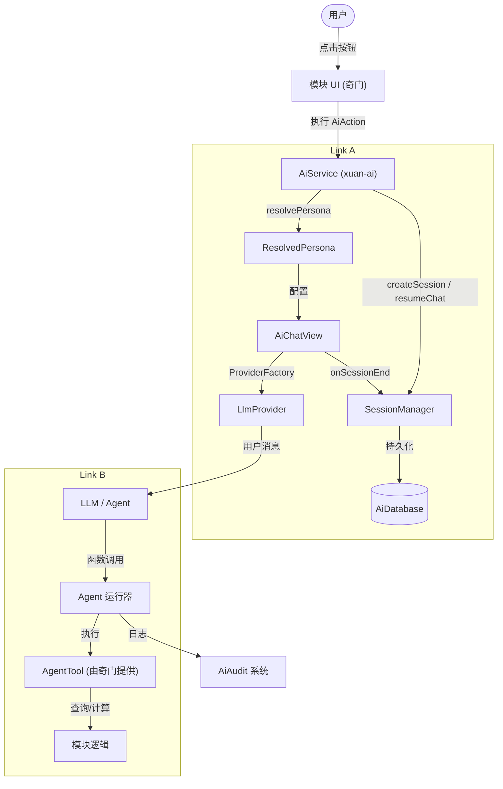

# AI 交互系统产品需求文档 (v1.1)

本文档正式确立了 Xuan 应用生态系统中 AI 集成的需求和规范。它响应了用户关于清晰分离“子模块访问 AI (Link A)”与“AI 访问子模块 (Link B)”的请求，并包含了审计功能的规范。

## 1. 执行摘要

本项目旨在将 AI 能力 (`xuan-ai`) 与领域特定模块（如 `xuan-qimendunjia`）集成，同时保持低耦合。该系统使用户能够执行 AI 辅助分析、摘要和复杂排盘，同时也允许 AI 安全地利用模块特定的数据和工具。

## 2. 核心概念与术语

### 2.1 通信通道

目前，通信在两个方向上流动，必须明确区分：

* **Link A (模块 -> AI)**: 子模块向 AI 请求服务。
  * **动作 (Action)**: `AiAction` (例如：“分析”、“总结”)。
  * **发起者**: 用户 / 子模块 UI。
  * **执行者**: AI 服务。
* **Link B (AI -> 模块)**: AI 向子模块请求能力。
  * **能力 (Capability)**: `AgentTool` (例如：“重新排盘”、“搜索历史”)。
  * **发起者**: AI Agent / LLM (基于上下文)。
  * **执行者**: 子模块逻辑。

### 2.2 共享模型 (`xuan-common`)

* `AiEntity`: 代表一个业务对象（如奇门局），包含结构化数据和自然语言描述。
* `AiContext`: `AiEntity` 对象和用户意图的容器。
  * `moduleName` (String, 必填): 调用模块的标识符（例如 `xuan-qimendunjia`）。用于审计和路由。
  * `intention` (String): 用户的目标或问题。
  * `entities` (List<AiEntity>): 与上下文相关的结构化数据。
  * `systemPromptOverride` (String?): 可选的系统指令覆盖。

## 3. 详细规格

### 3.1 Link A: 模块访问 AI (`AiAction`)

这允许子模块使用自定义按钮或命令扩展 AI 聊天界面。

* **接口**: `abstract class AiAction`
  * `id`: 唯一标识符 (例如: `qimen_summarize`)。
  * `label`: 显示文本。
  * `icon`: 显示图标。
  * `execute(context)`: 处理逻辑。
* **注册**: `AiService.registerAction(AiAction action)`
* **UI 集成**: 聊天窗口根据当前上下文动态渲染适用的动作。

### 3.2 Link A+: 高级交互 (`Persona` & `ChatView`)

除了简单的动作，子模块还可以请求更复杂的 AI 交互：

* **人设选择**: `AiService.showPersonaSelector(context, requiredSkills)`
  * 允许用户选择适合当前任务的特定 AI 人设（例如：“奇门遁甲大师”）。
  * 支持通过所需技能筛选人设（例如：仅显示懂奇门遁甲的人设）。
  * **新增人设**: 用户可以直接在此界面创建新人设。
* **人设解析**: `AiService.resolvePersona(personaUuid)`
  * 通过 DB 链式查找解析人设的完整运行时配置：`AiPersona → LlmModel → LlmProvider → PromptTemplate`。
  * 返回 `ResolvedPersona` 值对象，包含所有必要信息（apiKey, baseUrl, modelId, temperature, systemInstruction 等）。
  * 支持在人设配置不完整时回退到默认模型/提供商。
* **嵌入式聊天**: `AiService.buildChatView(context, initialContext)`
  * 允许将 AI 聊天界面直接嵌入到模块的 UI 中（例如：侧边栏或抽屉），而不是全屏模态窗口。

### 3.3 会话管理 (Session Management)

支持聊天会话的持久化、恢复和生命周期管理。

* **领域模型** (`xuan-common`):
  * `ResolvedPersona`: 封装人设完整运行时配置的值对象。包含提供商名称、API Key、Base URL、模型 ID、温度、Top P、最大 Token、系统指令以及显示元数据（名称、描述、头像）。
  * `SessionSummary`: 用于会话列表的轻量级元数据（UUID、标题、人设信息、消息计数、时间戳、状态）。

* **SessionManager** (`xuan-ai`):
  * `createSession(persona, initialContext?)` → 在 DB 创建新会话，返回会话 UUID。
  * `resumeSession(sessionUuid)` → 从 DB 加载会话，将消息反序列化为 `ChatMessage` 列表。
  * `saveHistory(sessionUuid, history)` → 将 Provider 的聊天历史持久化到 DB。
  * `listSessions(personaUuid?, status?)` → 返回过滤后的 `SessionSummary` 列表。
  * `archiveSession(sessionUuid)` / `deleteSession(sessionUuid)` / `resetSession(sessionUuid)`。

* **AiService 接口** (`xuan-common`):
  * `createSession(context, persona, initialContext?)` → 创建会话 + 打开聊天视图。
  * `resumeChat(context, sessionUuid)` → 从 DB 恢复会话 + 打开带历史记录的聊天视图。
  * `listSessions(personaUuid?, status?)` → 列出会话摘要。
  * `archiveSession(sessionUuid)` / `deleteSession(sessionUuid)`。

* **ProviderFactory** (`xuan-ai`):
  * `createFromPersona(persona, history?)` → 根据 `ResolvedPersona` 构造相应的 `LlmProvider` (DeepSeek / NVIDIA)。
  * 基于 `providerName` 和 `baseUrl` 自动选择 Provider 实现。
  * 所有 Provider 参数 (apiKey, baseUrl, modelId, temperature, systemInstruction) 均完全来自 `ResolvedPersona`。

* **AiChatView** (`xuan-ai`):
  * 纯展示组件。接收 `persona` + `sessionUuid` + 可选的 `history`。
  * 内部通过 `ProviderFactory` 构造自己的 `LlmProvider`，确保所有运行时配置来自人设。
  * 在页面销毁时触发 `onSessionEnd(history)`，允许上层持久化聊天消息。
  * **不**直接访问数据库。

### 3.4 Link B: AI 访问模块 (`AgentTool`)

这允许 AI “回调”应用以执行任务或查询数据。我们严格将其与 `AiAction` 区分开。

* **接口**: `abstract class AgentTool`
  * `name`: 供 LLM 使用的函数名 (例如: `search_qimen_history`)。
  * `description`: 供 LLM 阅读的描述。
  * `parametersSchema`: 参数的 JSON Schema。
  * `execute(args)`: 返回 Map 或 JSON 字符串。
* **注册**: `AiService.registerTool(AgentTool tool)`
  * *注意*: 注册表由 `AiService` (作为 Agent 运行器) 管理，但工具由模块提供。
* **发现**: AI Agent (如 `xuan-ai`) 在对话期间自动向 LLM 暴露已注册的工具。

### 3.3 GUI 控制 (`AgentTool` 实现)

为了允许 AI 操作 UI，应用层需注册特定的 `AgentTool`。

* **工具**:
  * `open_window(module_id, params)`
  * `minimize_window(window_id)`
  * `close_window(window_id)`
* **后端**: 由主 App 或 `xuan-common` 实现的 `WindowManager` 或 `Router` 处理实际的 UI 变更。

### 3.4 审计与安全 (`AiAudit`)

模块与 AI 之间的所有交互必须被记录，用于审计和调试。

* **范围**:
  * 用户提示词 (Prompts) & 上下文。
  * AI 响应。
  * **工具执行 (Link B)**: 安全的关键。我们必须记录 *调用了什么工具*，使用了 *什么参数*，以及 *何时* 调用的。
* **存储**: 本地 SQLite 表 `ai_audit_logs`。
* **Schema**:
  * `id`: UUID。
  * `timestamp`: DateTime。
  * `type`: 枚举 (`chat`, `action_call`, `tool_call`, `tool_result`)。
  * `source_module`: 字符串 (例如: `xuan-qimen`)。
  * `payload`: JSON (已清洗)。
* **隐私**: `payload` 中的敏感数据必要时应进行脱敏处理。

## 4. 架构图 (概念)

## 5. 非功能性需求

* **性能**: 工具执行应尽可能非阻塞。
* **安全**: `AgentTool` 必须严格验证其输入参数。
* **隐私**: 历史数据查询必须尊重用户的本地隐私设置。
* **可扩展性**: 添加新模块不应要求修改 `xuan-ai` 代码。
